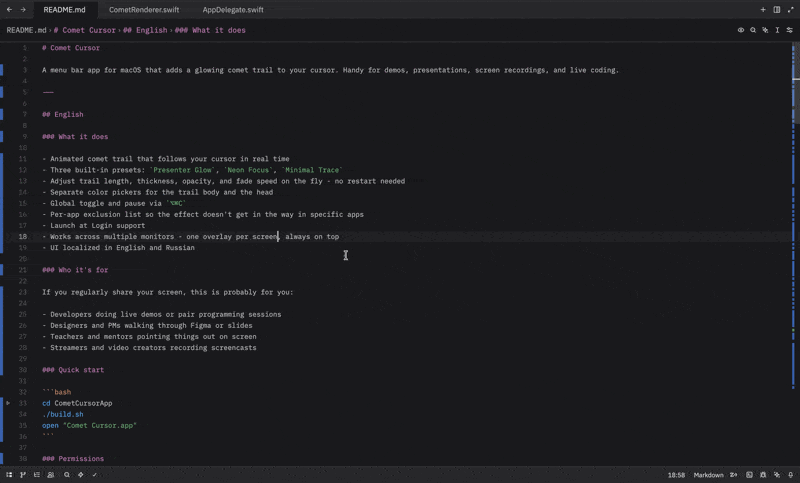
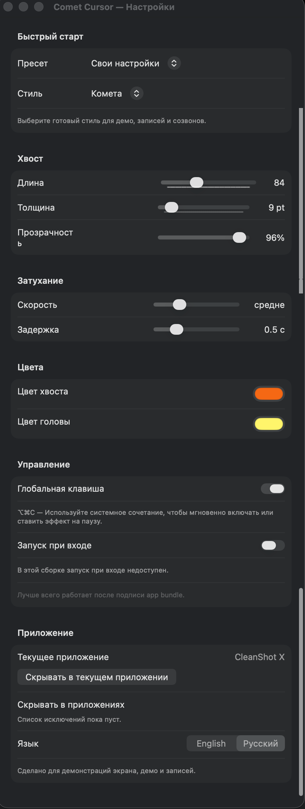

# Comet Cursor

A menu bar app for macOS that adds a glowing comet trail to your cursor. Handy for demos, presentations, screen recordings, and live coding.

<p align="center">
  
</p>

---

## Download

**[Download latest release](../../releases/latest)** - grab the `.dmg`, open it, drag to Applications.

> First launch: macOS will warn that the app is from an unidentified developer (it's not signed with a $99/yr Apple certificate). Right-click the app -> **Open** -> **Open** to allow it once. After that it launches normally.

---

## English

### What it does

- Animated comet trail that follows your cursor in real time
- Three built-in presets: `Presenter Glow`, `Neon Focus`, `Minimal Trace`
- Adjust trail length, thickness, opacity, and fade speed on the fly - no restart needed
- Separate color pickers for the trail body and the head
- Global toggle and pause via `⌥⌘C`
- Per-app exclusion list so the effect doesn't get in the way in specific apps
- Launch at Login support
- Works across multiple monitors - one overlay per screen, always on top
- UI localized in English and Russian

### Who it's for

If you regularly share your screen, this is probably for you:

- Developers doing live demos or pair programming sessions
- Designers and PMs walking through Figma or slides
- Teachers and mentors pointing things out on screen
- Streamers and video creators recording screencasts

### Quick start

```bash
cd CometCursorApp
./build.sh
open "Comet Cursor.app"
```

### Permissions

The app tracks the cursor via `CGEventTap`, which requires **Accessibility** access. Without it, macOS won't let the event tap run.

To enable:

1. Open `System Settings -> Privacy & Security -> Accessibility`
2. Add `Comet Cursor` to the list

If you skip this, the app falls back to a polling-based tracker - it works, but cursor position updates are slightly less precise.

### Architecture

<p align="center">
  
</p>

Built with **SwiftUI + Metal + AppKit**, targeting macOS 13+.

| File | What it does |
|---|---|
| `AppDelegate.swift` | Menu bar item, settings window, overlay window lifecycle |
| `CursorTracker.swift` | CGEventTap with polling fallback |
| `TrailManager.swift` | Trail point history, timestamp-based fade logic |
| `CometRenderer.swift` | Metal rendering, ribbon geometry, presets |
| `SettingsModel.swift` | ObservableObject wrapping UserDefaults |
| `SettingsView.swift` | SwiftUI settings panel, sliders, color pickers |

**Data flow:**
```
CGEventTap -> DispatchQueue.main -> TrailManager.update()
                                          |
MTKView render thread -> TrailManager.tick() + snapshot() -> CometRenderer.draw()
```

**Rendering:** The trail is a Metal triangle strip ribbon. Each trail point generates a left/right vertex pair; adjacent segments share vertices so there are no gaps at joints. Soft-edge falloff is done in the fragment shader rather than relying on `glLineWidth`. Shaders are compiled at runtime from a source string via `device.makeLibrary(source:)` - no `xcrun metal` needed at build time.

**Multi-monitor:** `NSScreen.screens` gives us the list of active displays. We create one `NSWindow + MTKView` per screen and position each with `setFrame(screen.frame)`.

**Coordinate conversion:** CGEvent uses a top-left origin (Y increases downward), AppKit uses bottom-left (Y increases upward). The conversion happens before passing points to the renderer.

---

## Скачать

**[Скачать последний релиз](../../releases/latest)** - скачай `.dmg`, открой, перетащи в Applications.

> При первом запуске macOS покажет предупреждение о неизвестном разработчике (приложение не подписано платным сертификатом Apple). Нажми правой кнопкой на приложение -> **Открыть** -> **Открыть** - и больше это предупреждение не появится.

---

## Русский

### Что умеет

- Анимированный хвост кометы в реальном времени
- Три пресета: `Presenter Glow`, `Neon Focus`, `Minimal Trace`
- Настройка длины, толщины, прозрачности и скорости затухания на лету - без перезапуска
- Отдельные цветопикеры для тела хвоста и его головы
- Глобальное включение/пауза через `⌥⌘C`
- Список исключений - можно отключить эффект в конкретных приложениях
- Запуск при входе в систему
- Работает на нескольких мониторах - отдельный overlay на каждый экран, всегда поверх окон
- Интерфейс на английском и русском

### Для кого

Если вы регулярно показываете экран, это приложение для вас:

- Разработчики на демо и парном программировании
- Дизайнеры и PM на презентациях в Figma или слайдах
- Преподаватели и менторы, объясняющие что-то на экране
- Стримеры и авторы скринкастов

### Быстрый старт

```bash
cd CometCursorApp
./build.sh
open "Comet Cursor.app"
```

### Разрешения

Приложение отслеживает курсор через `CGEventTap`, для которого нужен доступ к **Accessibility**. Без него macOS просто не даст создать event tap.

Как включить:

1. `System Settings -> Privacy & Security -> Accessibility`
2. Добавьте `Comet Cursor` в список разрешённых приложений

Если пропустить этот шаг, приложение переключится на polling-режим - работает, но с чуть меньшей точностью позиции курсора.

### Архитектура

Написано на **SwiftUI + Metal + AppKit**, минимальная версия macOS 13.

| Файл | За что отвечает |
|---|---|
| `AppDelegate.swift` | Иконка в меню-баре, окно настроек, lifecycle overlay-окон |
| `CursorTracker.swift` | CGEventTap и fallback через polling |
| `TrailManager.swift` | История точек хвоста, fade по timestamp |
| `CometRenderer.swift` | Metal-рендеринг, геометрия ленты, пресеты |
| `SettingsModel.swift` | ObservableObject поверх UserDefaults |
| `SettingsView.swift` | SwiftUI-панель настроек, слайдеры, цветопикеры |

**Поток данных:**
```
CGEventTap -> DispatchQueue.main -> TrailManager.update()
                                          |
MTKView render thread -> TrailManager.tick() + snapshot() -> CometRenderer.draw()
```

**Рендеринг:** Хвост - это Metal triangle strip (лента). Каждая точка хвоста генерирует пару вершин (левая/правая), соседние сегменты разделяют вершины - никаких разрывов на стыках. Размытие края реализовано в фрагментном шейдере, без `glLineWidth`. Шейдеры компилируются прямо в рантайме из строки через `device.makeLibrary(source:)` - `xcrun metal` при сборке не нужен.

**Мультимонитор:** Берём список экранов из `NSScreen.screens`, создаём по одному `NSWindow + MTKView` на каждый и позиционируем через `setFrame(screen.frame)`.

**Конвертация координат:** CGEvent считает Y сверху вниз, AppKit - снизу вверх. Конвертация происходит до передачи точек в рендерер.

---

## Go Prototype

The original Go + CGo + OpenGL proof of concept lives in [`prototype-go/`](./prototype-go/). It's archived and not maintained - kept around as a reference for the early approach.

---

## Support

If the app is useful to you, you can support development:

- [Boosty](https://boosty.to/zaitsev_av)

## License

MIT
